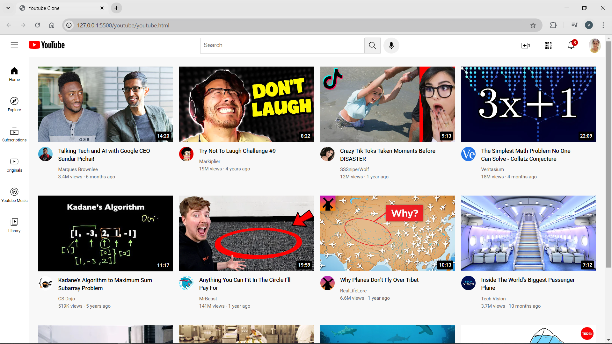

# YouTube Homepage Clone

This project is a clone of the YouTube homepage, built using HTML and CSS. It aims to replicate the layout and design of the YouTube platform while providing a simple and clean interface.

## Features

- **Responsive Design**: The layout adjusts for various screen sizes, ensuring a good user experience on both desktop and mobile devices.
- **Video Grid Layout**: Displays a grid of video thumbnails similar to the YouTube homepage.
- **Header and Navigation**: Includes a header with a search bar and navigation links.
- **Side Bar**: A Sidebar with additional links.

## Technologies Used

- **HTML**: For structuring the web pages.
- **CSS**: For styling and layout design.

## Preview

Tutorials by the **SuperSimpleDev** Youtube channel guided me throughout this project.
